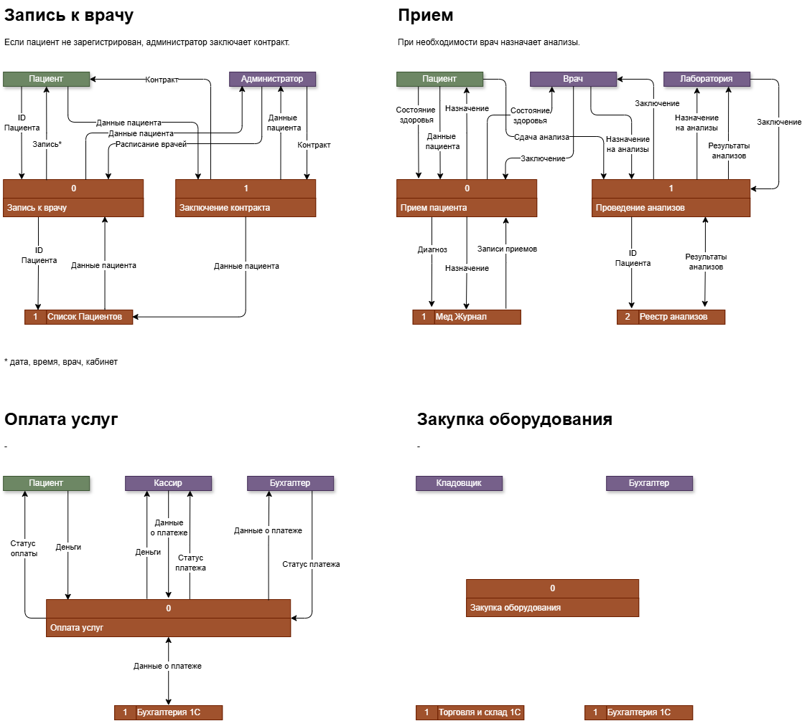

# Анализ безопасности системы
## Анализ потоков данных

[Data Flow Diagrams](Flow1.drawio)
## Аудит мер безопасности
| Что происходит с данными                                                                          | Данные   | Нарушение / Проблема         |
|---------------------------------------------------------------------------------------------------|----------|------------------------------|
| Хранение локально в файлах                                                                        | PII, PHI | Небезопасное хранение        |
| Запись и сохранение в локальные файлы, передача по почте                                          | PII, PHI | Небезопасное передача        |
| Записи пациентов хранятся вместе, риск передачи данных другого пациента                           | PHI      | Риски конфиденциальности     |
| Расширенная форма сбора данных                                                                    |          | Избыточный сбор данных       |
| Всю информацию обрабатывают вручную, передача через файлы и в устной форме, нет истории изменений |          | Непрозрачность потоков       |
| Нет анонимизации, привязка к пациенту его идентификации                                           |          | Отсутствие анонимизации      |
| Нет протоколов уничтожения данных, по запросу или при истечении срока хранения                    |          | Отсутствие утилизация данных |
|                                                                                                   |          |                              |
|                                                                                                   |          |                              |

## Данные для защиты
| Данные                            | Требуется защита                      | Тег                |
|-----------------------------------|---------------------------------------|--------------------|
| Идентификационные данные пациента | Шифрование, обфускация                | PII                |
| Медицинские записи пациента       | Обезличивание, шифрование             | PHI                |
| Дополнительные данные пациента    | Обезличивание, шифрование, обфускация | PII                |
| Результаты анализов               | Обезличивание, шифрование             | Клинические данные |
| Платежные данные                  | Шифрование, обфускация                | FIN                |
| Данные закупок                    | Шифрование, обфускация                | FIN                |
| Контракт с пациентом              | Шифрование, обфускация                | LEGAL              |

## Предлагаемы меры для защиты данных
| Мера                                | Инструмент                 | Обоснование                                             |
|-------------------------------------|----------------------------|---------------------------------------------------------|
| Тегирование данных                  | Кастом, полуавтоматическое | Разметка данных поможет их анализировать и обрабатывать |
| Предотвращение утечки (DLP)         | Symantec DLP               | Предотвратит утечку в том числе по неосторожности       |
| Контроль доступа (RBAC)             | Active Directory           | Ограничит доступ по ролям: врач, администратор и тд     |
| Обучение и информирование персонала |                            | Предотвратит случайные утечки                           |
|                                     |                            |                                                         |
|                                     |                            |                                                         |

