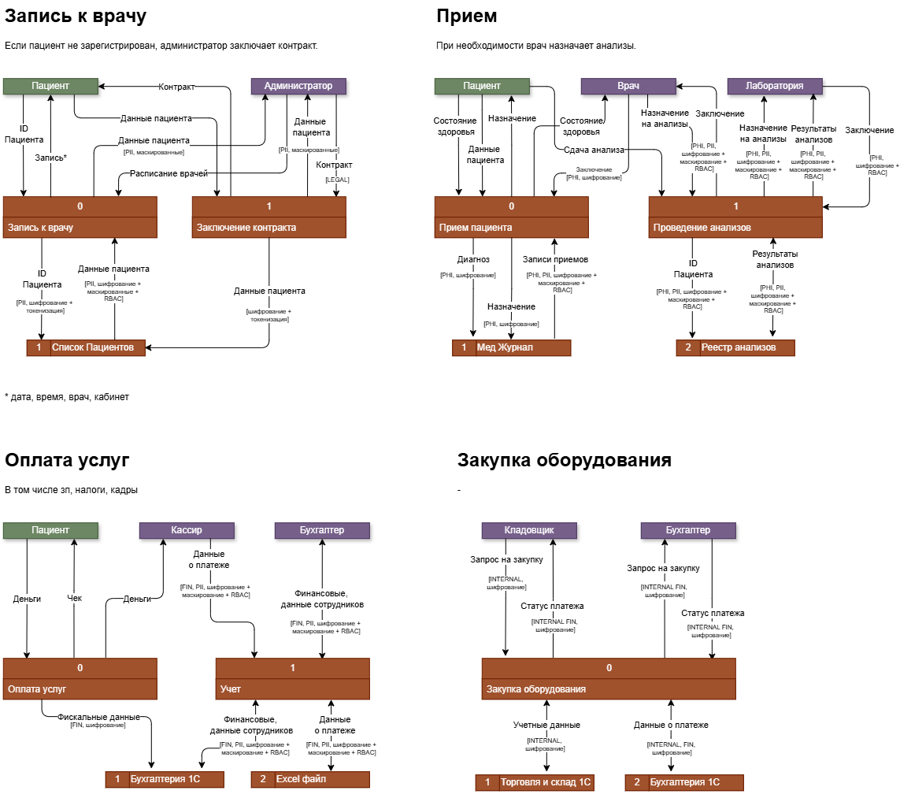

# Анализ безопасности системы
## Анализ потоков данных

## Аудит мер безопасности
| Что происходит с данными                                                                          | Данные   | Нарушение / Проблема                |
|---------------------------------------------------------------------------------------------------|----------|-------------------------------------|
| Хранение локально в файлах                                                                        | PII, PHI | Небезопасное хранение               |
| Запись и сохранение в локальные файлы, передача по почте                                          | PII, PHI | Небезопасное передача               |
| Записи пациентов хранятся вместе, риск передачи данных другого пациента                           | PHI      | Риски конфиденциальности            |
| Всю информацию обрабатывают вручную, передача через файлы и в устной форме, нет истории изменений | PII, PHI | Непрозрачность потоков              |
| Нет анонимизации, привязка к пациенту его идентификации                                           | PII, PHI | Отсутствие анонимизации             |
| Нет протоколов уничтожения данных, по запросу или при истечении срока хранения                    | PII, PHI | Отсутствие утилизация данных        |
| Двойной учет данных                                                                               | PII, FIN | Отсутствие единого источника правды |
| Хранение в 1С, бухгалтерия видит и клиентские, и кадровые данные                                  | PII, FIN | Нет разделения на контуры           |
| Контроль доступа - вход в домен без ролей, данные не разделены                                    | все      | Нет разграничения доступа к данным  |

## Данные для защиты
| Данные                            | Требуется защита                        | Тег                |
|-----------------------------------|-----------------------------------------|--------------------|
| Идентификационные данные пациента | Шифрование, маскирование                | PII                |
| Медицинские записи пациента       | Обезличивание, шифрование, маскирование | PHI                |
| Дополнительные данные пациента    | Обезличивание, шифрование, маскирование | PII                |
| Результаты анализов               | Обезличивание, шифрование, маскирование | Клинические данные |
| Платежные данные                  | Шифрование, обфускация                  | FIN                |
| Данные закупок                    | Шифрование                              | INTERNAL           |
| Контракт с пациентом              | Шифрование                              | LEGAL              |

## Предлагаемы меры для защиты данных
| Мера                                | Инструмент                 | Обоснование                                                     |
|-------------------------------------|----------------------------|-----------------------------------------------------------------|
| Тегирование данных                  | Кастом, полуавтоматическое | Разметка данных поможет их анализировать и обрабатывать         |
| Предотвращение утечки (DLP)         | Symantec DLP               | Предотвратит утечку в том числе по неосторожности               |
| Контроль доступа (RBAC)             | настройка Active Directory | Ограничит доступ по ролям: врач, администратор и тд             |
| Централизованный доступ (SSO)       | Keycloak                   | Единая точка для RBAC/ABAC вместо голой доменной аутентификации |
| Аудит доступа и SIEM                | Elastic, VictoriaMetrics   | Даст аудит доступа + нетипичные действия                        |
| Обучение и информирование персонала |                            | Предотвратит случайные утечки                                   |
| Анонимизация                        | Presidio                   | Анализ данных и скрытие персональной информации                 |
| Шифрование канала                   | добавить TLS 1.2+/1.3      | Сейчас трафик ККМ ↔ 1С не защищён                               |
| Шифрование данных на диске          | BitLocker                  | Закрывает риск кражи диска                                      |

## Схема с предлагаемыми мерами защиты
