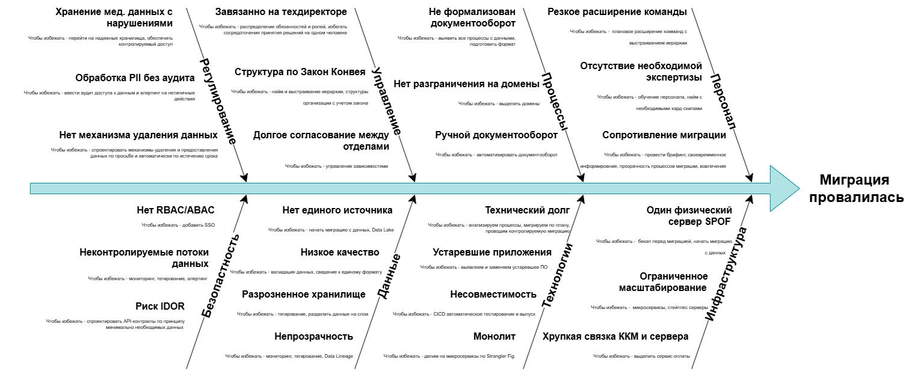

# Оценка узких мест при миграции

| Приоритет | Проблема | Решение |
|---|---|---|
| P0 | Хранение мед. данных с нарушениями | Перейти на надёжные хранилища, обеспечить контролируемый доступ |
| P0 | Обработка PII без аудита | Ввести аудит доступа к данным и алертинг на нетипичные действия |
| P0 | Нет механизма удаления данных | Спроектировать механизмы удаления и предоставления данных по запросу и автоматически по истечении срока |
| P0 | Риск IDOR | Спроектировать API-контракты по принципу минимально необходимых данных |
| P0 | Нет RBAC/ABAC | Добавить SSO |
| P0 | Один физический сервер (SPOF) | Бэкап перед миграцией, начать миграцию с данных |
| P0 | Неконтролируемые потоки данных | Мониторинг, тегирование, алертинг |
| P1 | Монолит | Делим на микросервисы по Strangler Fig |
| P1 | Нет разграничения на домены | Выделить домены |
| P1 | Разрозненное хранилище | Тегирование, разделить данные на слои |
| P1 | Нет единого источника данных | Начать миграцию с данных, Data Lake |
| P1 | Низкое качество данных | Валидация данных, сведение к единому формату |
| P1 | Технический долг | Анализируем процессы, мигрируем по плану, проводим контролируемую миграцию |
| P1 | Устаревшие приложения | Выявляем и заменяем устаревшее ПО |
| P1 | Хрупкая связка ККМ и сервера | Выделить сервис оплаты |
| P1 | Ограниченное масштабирование | Микросервисы, стейтлес-серверы |
| P1 | Завязано на техдиректоре | Распределение обязанностей и ролей, избегать сосредоточения решений на одном человеке |
| P2 | Не формализован документооборот | Выявить все процессы с данными, подготовить формат |
| P2 | Ручной документооборот | Автоматизировать документооборот |
| P2 | Несовместимость | CI/CD, автоматическое тестирование и выпуск |
| P2 | Непрозрачность | Мониторинг, тегирование, Data Lineage |
| P2 | Долгое согласование между отделами | Управление зависимостями |
| P2 | Структура по закону Конвея | Найм и выстраивание иерархии/структуры организации с учётом закона |
| P2 | Отсутствие необходимой экспертизы | Обучение персонала, найм с необходимыми хард-скиллами |
| P2 | Резкое расширение команды | Плановое расширение команд с выстраиванием иерархии |
| P2 | Сопротивление миграции | Брифинг, своевременное информирование, прозрачность процессов миграции, вовлечение |

**Легенда приоритетов:** P0 — критично (риски безопасности/утечки данных, единая точка отказа), P1 — высокий (архитектурные блокеры миграции), P2 — средний (организационные и процессные меры).
